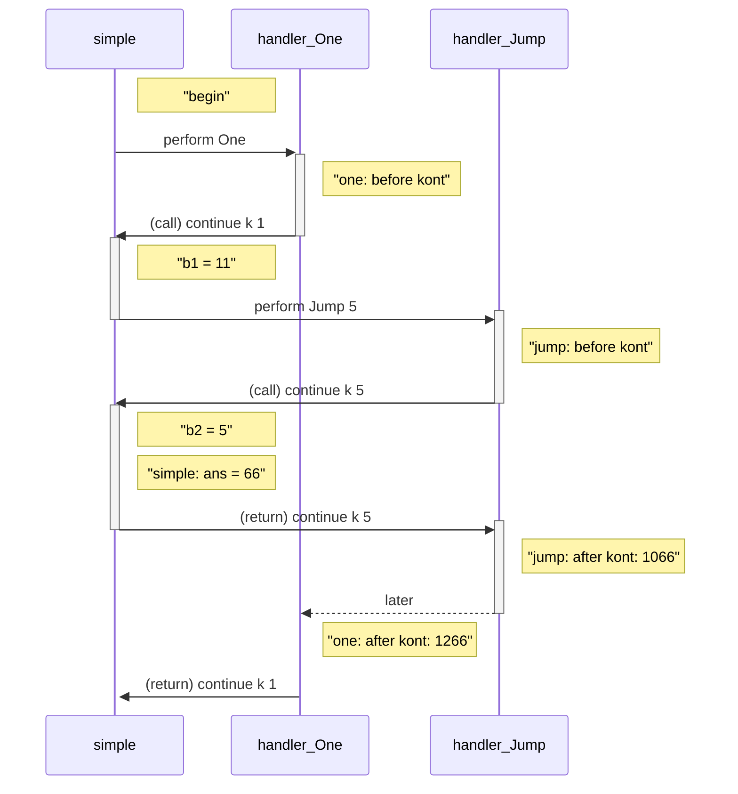

# t4_get_value

```mermaid
sequenceDiagram
  participant ss as simple
  participant ho as handler_One
  participant hj as handler_Jump

  Note right of ss: "begin"
  ss ->> +ho : perform One
  Note right of ho: "one: before kont"

  ho ->> -ss : (call) continue k 1

  activate ss
    Note right of ss: "b1 = 11"
    ss ->> +hj : perform Jump 5
  deactivate ss  
  
  Note right of hj: "jump: before kont"
  hj  ->> -ss : (call) continue k 5

  activate ss
    Note right of ss: "b2 = 5"
    Note right of ss: "simple: ans = 66"
    ss ->> +hj : (return) continue k 5
  deactivate ss

  Note right of hj: "jump: after kont: 1066"

  hj  -->> -ho : later
  Note right of ho: "one: after kont: 1266"

  ho  ->> +ss : (return) continue k 1
```
