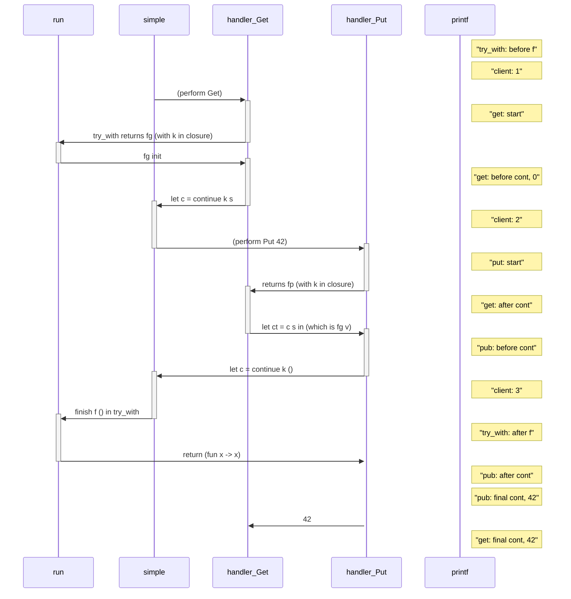

# t5_state

This diagram is for [`bin/t4_state.ml`](https://github.com/arbipher/ocaml-examples/blob/master/ocaml5-play/bin/t5_state.ml).

```mermaid
sequenceDiagram
  participant rr as run
  participant ss as simple
  participant hg as handler_Get
  participant hp as handler_Put
  participant pp as printf

  Note right of pp: "try_with: before f"
  Note right of pp: "client: 1"
  ss ->> +hg : (perform Get)
  Note right of pp: "get: start"

  hg ->> -rr : try_with returns fg (with k in closure)
  activate rr

  rr ->> +hg : fg init
  deactivate rr

  Note right of pp: "get: before cont, 0"

  hg ->> +ss : let c = continue k s
  deactivate hg

  Note right of pp: "client: 2"
  
  ss ->> +hp : (perform Put 42)
  deactivate ss

  Note right of pp: "put: start"
  hp  ->> +hg : returns fp (with k in closure)
  deactivate hp

  Note right of pp: "get: after cont"
  hg  ->> +hp : let ct = c s in (which is fg v)
  deactivate hg

  Note right of pp: "pub: before cont"
  
  hp  ->> +ss : let c = continue k ()
  deactivate hp

  Note right of pp: "client: 3"

  ss ->> +rr : finish f () in try_with
  deactivate ss

  Note right of pp: "try_with: after f"

  rr ->> +hp : return (fun x -> x)
  deactivate rr

  Note right of pp: "pub: after cont"
  Note right of pp: "pub: final cont, 42"

  hp  ->> hg : 42
  Note right of pp: "get: final cont, 42"
```
